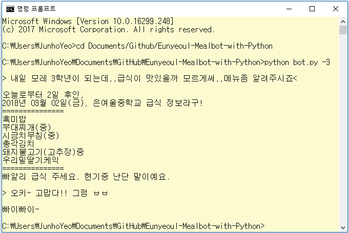

# Eunyeoul Mealbot with Python
은여울중학교(경기도 김포시)의 급식 데이터를 가져오는 파이썬 급식봇 프로그램<br>
<br>
~~예제 무엇...~~

| Date | Progress |
| :------------- | :------------- |
| 2018.02.28 | 제작 |
| 2018.04.04 | 모듈화 |

## 다른 프로젝트에 사용 및 응용 방법
`parsemeal.py` 파일을 작업 디렉토리로 옮긴 뒤
```Python
from parsemeal import *
```
등의 방법으로 `module`을 `import`합니다.

#### mealparse 함수의 호출
```Python
mealparse(date, weekday, eduOfficeURL, schulCode, schulKndScCode, schMmealScCode)
```

- `date` : yyyy.mm.dd 형식의 문자열
- `weekday` : 월요일~금요일(0~6)과 같은 요일 인덱스
- `eduOfficeURL` : 급식 데이터를 가져올 학교가 위치한 지역의 교육청
- `schulCode` :  학교 코드
- `schulKndScCode` : 학교 종류 코드
- `schMmealScCode` : 급식 종류 코드

위와 같이 `mealparse` 함수를 호출할 수 있습니다.

#### mealparse 함수의 리턴값

- `mealparse` 함수는 요청받은 날짜의 급식 데이터를 정리하여 반환합니다.
- 데이터가 없거나 에러가 발생했을 경우 `mealparse` 함수는 `error` 문자열을 반환합니다.

## 사양
#### 이 프로그램을 실행하려면...

- `Python3`이 설치된 환경이여야 합니다.
- `Python3`의 `requests`, `bs4(BeautifulSoup 4)` module이 설치되어 있어야 합니다.

#### module이 없다면?
```
pip install requests
pip install bs4
```
또는
```
pip3 install requests
pip3 install bs4
```
`Python3`이 설치된 터미널에서 위 명령을 실행하는 것으로 필요한 module 설치가 가능합니다.

## 사용방법
```
cd Documents/Github/Eunyeoul-Mealbot-with-Python
python bot.py -3
```
이 저장소를 클론하거나 다운받고, 위와 같이 `bot.py` 파일이 있는 곳으로 이동하고 `Python3`으로 실행합니다.

#### 오늘의 급식?
```
> 오늘의 급식

2018년 02월 28일(수), 은여울중학교 급식 정보라구!
===============
해당 날짜에는 급식이 없습니다.
===============
ㄱ...그,급식이 없다고요...??
```
위와 같이 `오늘`, `투데이`, `today` 키워드를 사용한 입력으로 현재 날짜의 급식을 출력할 수 있습니다. ~~봄방학이라 급식이 없다고 나오네요. 야호~~<br>
급식이 없는 날, 급식봇의 멘트는 랜덤(1/3 확률)으로 3가지 경우 중 하나로 출력됩니다.

#### 내일이랑 내일 모레의 급식은?
```
> 내일 급식

오늘로부터 1일 후인,
2018년 03월 01일(목), 은여울중학교 급식 정보라구!
===============
해당 날짜에는 급식이 없습니다.
===============
ㄱ...그,급식이 없다고요...??
```
`내일`, `다음날`, `tommorow` 키워드를 사용한 입력으로 현재 날짜의 급식을 출력할 수 있습니다.
```
> 내일 모레 급식

오늘로부터 2일 후인,
2018년 03월 02일(금), 은여울중학교 급식 정보라구!
===============
흑미밥
부대찌개(중)
시금치무침(중)
총각김치
돼지불고기(고추장)중
우리밀딸기케익
===============
빠알리 급식 주세요. 현기증 난단 말이예요.
```
`모레`, `이틀`, `day after tommorow` 키워드를 사용한 입력으로 현재 날짜의 급식을 출력할 수 있습니다.

#### 어제랑 그저께는 무슨 급식이?
```
> 어제 급식

오늘로부터 1일 전인,
2018년 02월 27일(화), 은여울중학교 급식 정보라구!
===============
해당 날짜에는 급식이 없습니다.
===============
씌익,,씌이익, 급식이 왜 없는 건데에
```
`어제`, `하루 전`, `yesterday`의 키워드를 사용한 입력으로 현재 날짜 기준으로 하루 전 급식을 조회할 수 있습니다.
```
> 그저께 급식

오늘로부터 2일 전인,
2018년 02월 26일(월), 은여울중학교 급식 정보라구!
===============
해당 날짜에는 급식이 없습니다.
===============
안돼... 급식이 없어!..부들,,부들
```
`그제`, `그저께`, `이틀 전`, `day before yesterday`의 키워드를 사용한 입력으로 현재 날짜 기준으로 이틀 전 급식을 조회할 수 있습니다.

#### n일 후 또는 n일 전의 급식
```
> 14

오늘로부터 14일 후인,
2018년 03월 14일(수), 은여울중학교 급식 정보라구!
===============
곤드레나물밥(달래양념장+무조미
미역된장국(중)
떡볶이(가래떡중)
김말이튀김(중)
배추김치
===============
빠알리 급식 주세요. 현기증 난단 말이예요.
```
정수 `n`을 입력하는 것으로 현재 날짜 기준으로 `n`일 후의 급식을 확인할 수 있습니다.
```
> 7일 후에는 대체 무슨 급식이 나올까 너무 설레요.

오늘로부터 7일 후인,
2018년 03월 07일(수), 은여울중학교 급식 정보라구!
===============
닭고기카레밥(중)
도라지진미채무침(중)
갈릭고구마파이
배추김치
블루베리쥬스
===============
빠알리 급식 주세요. 현기증 난단 말이예요.
```
정수 하나만을 입력하는 대신, 맨 앞 자리가 한 자리 정수 `n`인 문자열을 입력함으로써 `n`일 후의 급식을 확인할 수 있습니다.<br>
즉 두 자리 이상의 양수나 음수를 인식하지는 못합니다. 그러한 값을 입력했을 경우 아래와 같이 처리됩니다.

- 두 자리 이상의 양수를 입력하게 된 경우 : 해당 수의 맨 앞 자릿수 하나를 입력받은 것으로 처리됩니다. 예를 들어서 `534일 후`를 입력한 경우, `5`를 입력한 것으로 처리되어 5일 후의 데이터가 출력됩니다.

- 음수값을 입력하게 된 경우 : 맨 앞 문자가 `-`으로 `인식하지 못하는 입력`으로 처리되어 오늘의 급식이 출력됩니다.


```
> -100

오늘로부터 100일 전인,
2017년 11월 20일(월), 은여울중학교 급식 정보라구!
===============
흑미밥
LA갈비구이(중)
실곤약채소무침(중)
총각김치
감자모시조개국(중)
===============
빠알리 급식 주세요. 현기증 난단 말이예요.
```
정수 `-n`을 입력하는 것으로 현재 날짜 기준으로 `n`일 전의 급식을 확인할 수 있습니다.

#### 인식하지 못하는 입력 처리
```
> 앓묽맖댅잖짉를 햌봌겤씁닠닼

2018년 02월 28일(수), 은여울중학교 급식 정보라구!
===============
해당 날짜에는 급식이 없습니다.
===============
안돼... 급식이 없어!..부들,,부들
```
프로그램이 인식하지 못하는 문자열이 입력된 경우, 오늘의 급식이 출력됩니다. ~~급식봇에게 욕해봤자 얻는 건 오늘의 급식뿐(?)~~

#### 프로그램 종료
```
> 이제 너 자신을 종료하도록 하여라.

빠이빠이~

C:\Users\JunhoYeo\Documents\GitHub\Eunyeoul-Mealbot-with-Python>
```
`잘가`, `뱌뱌`, `빠이`, `ㅂㅂ`, `ㅂㅇ` , `ㅃㅃ`, `ㅃㅇ`, `나가기`, `종료`, `exit`, `quit` 키워드를 사용하여 급식봇을 종료할 수 있습니다.
